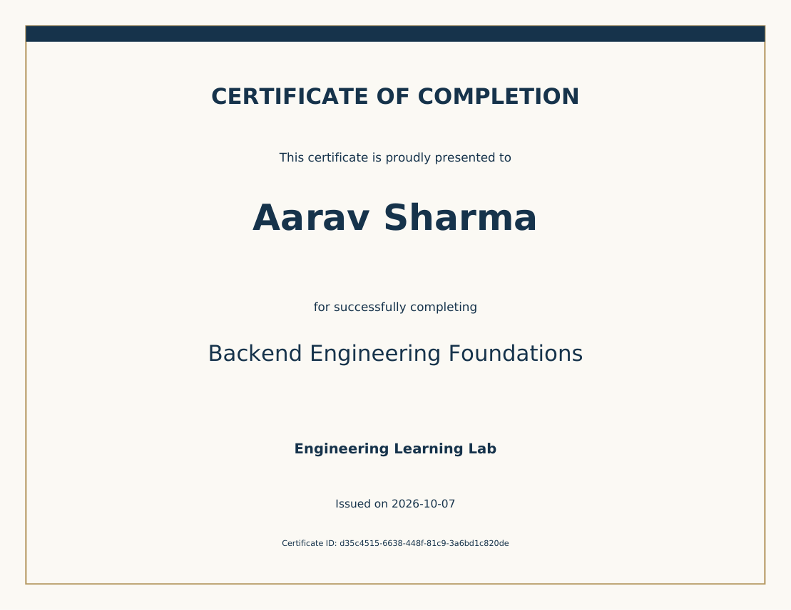

# Certificate Forge

[](https://github.com/NikhilAA123/certificate-forge/actions/workflows/ci.yml)

A Python backend that turns one recipient list into downloadable PDF certificates. The API saves a durable job and returns `202 Accepted`; a separate worker generates certificates, records each outcome, and continues when an individual recipient fails.

Built for the **Bulk Certificate Generator Backend Assignment**. The implementation uses FastAPI, SQLite, Pydantic, and ReportLab. It includes the required workflow, automated tests, and a few practical extras: idempotency keys, failed-only retries, paginated results, and ZIP downloads with an outcome manifest.



## Start locally

Requires Python 3.12 or later. No Redis, Docker, database server, or external account is needed.

Windows PowerShell:

```powershell
cd certificate-forge
py -m venv .venv
.\.venv\Scripts\python.exe -m pip install -c requirements.lock -e ".[dev]"
.\.venv\Scripts\python.exe -m certificate_forge
```

macOS or Linux:

```bash
python3 -m venv .venv
.venv/bin/python -m pip install -c requirements.lock -e '.[dev]'
.venv/bin/python -m certificate_forge
```

Open **http://127.0.0.1:8000/docs** for the interactive API. The launcher runs the API and worker as separate processes and stops the worker when the API exits. Use `--port 8001` if needed. Stop with Ctrl+C.

For independent process management:

```bash
python -m uvicorn certificate_forge.app:create_app --factory --host 127.0.0.1 --port 8000
python -m certificate_forge.worker
```

Run these in separate terminals using the same working directory and environment. Data is stored under `data/` by default. Set `CERTIFICATE_DATA_DIR` to an absolute path to choose another local directory. Both processes must use the same database and artifact directory.

## Try a complete request

The example deliberately includes an invalid email to demonstrate partial success.

```powershell
$body = Get-Content examples/job.json -Raw
$job = Invoke-RestMethod -Method Post -Uri http://127.0.0.1:8000/api/jobs `
  -ContentType application/json -Headers @{ 'Idempotency-Key' = 'demo-001' } -Body $body
$job
Invoke-RestMethod "http://127.0.0.1:8000/api/jobs/$($job.id)"
Invoke-RestMethod "http://127.0.0.1:8000/api/jobs/$($job.id)/recipients"
# Run once the job is terminal:
Invoke-WebRequest "http://127.0.0.1:8000/api/jobs/$($job.id)/download" -OutFile certificates.zip
```

Equivalent submission with curl:

```bash
curl -i -X POST http://127.0.0.1:8000/api/jobs \
  -H 'Content-Type: application/json' \
  -H 'Idempotency-Key: demo-001' \
  --data-binary @examples/job.json
```

Replace the key when changing the payload. A replay of the same key and payload returns the existing job with `200 OK` and `Idempotency-Replayed: true`. A different payload with the same key returns `409 IDEMPOTENCY_CONFLICT`. Without a key, every submission creates a new job. Hashing normalizes JSON key order and job fields; recipient ordering and recipient field whitespace remain significant.

## API

| Method | Endpoint | Behavior |
|---|---|---|
| POST | `/api/jobs` | Validate and persist up to 1,000 recipients; return 202 |
| GET | `/api/jobs/{id}` | Status, counts, progress, timestamps, and links |
| GET | `/api/jobs/{id}/recipients` | Outcomes with `limit`, `offset`, and optional `status` |
| GET | `/api/jobs/{id}/certificates/{recipient_id}` | Download an individual successful PDF |
| GET | `/api/jobs/{id}/download` | Download successful PDFs and `manifest.json` in a ZIP |
| POST | `/api/jobs/{id}/retry` | Requeue failed generations below the attempt limit |
| GET | `/health/live` | API process is responding |
| GET | `/health/ready` | Database responds and a worker heartbeat is recent |

Job input:

```json
{
  "title": "Backend Engineering Foundations",
  "issuer": "Engineering Learning Lab",
  "issued_on": "2026-10-07",
  "recipients": [
    {"name": "Aarav Sharma", "email": "aarav@example.com"}
  ]
}
```

Names are limited to 120 characters, titles to 160, issuers to 120. Unknown fields and control characters are rejected. Email addresses are syntax-validated without network/DNS requests. Email is recipient metadata; this application does not send email. Duplicate recipients are preserved because each input position represents a requested certificate.

The job envelope must be valid or the API returns 422. A malformed individual recipient is stored as `INVALID`, identified by its zero-based input index, while valid recipients continue. Raw invalid payloads are not stored. A job containing only invalid recipients is immediately `FAILED`, with 100% processed progress.

Job states: `QUEUED` → `PROCESSING` → `COMPLETED`, `PARTIALLY_COMPLETED`, or `FAILED`. Each recipient is `PENDING`, `PROCESSING`, `SUCCEEDED`, `FAILED`, or `INVALID`. Progress is `(succeeded + failed + invalid) / total`, so 100% means processing has finished, not that every certificate succeeded. Retrying may reduce progress as failed recipients become pending again.

Downloads use server-generated UUID filenames. The manifest maps each filename to its recipient and records errors and SHA-256 hashes. Individual PDFs also return `X-Certificate-SHA256`. ZIPs are available for terminal jobs with at least one success. Individual certificates can be downloaded as soon as they succeed.

Expected errors use `{"detail":{"code":"...","message":"..."}}`; FastAPI's validation errors use its standard 422 detail list. Missing resources return 404, unavailable results and incompatible transitions return 409, oversized requests return 413, and storage/database unavailability returns 503.

## Architecture and object-oriented design

```text
HTTP request → FastAPI controllers → CertificateJobService → JobRepository → SQLite
                                                               ↑
Worker process → CertificateWorker → CertificateRenderer → LocalCertificateStorage
```

| Component | Responsibility |
|---|---|
| `app.py` | HTTP routing, dependency composition, authentication, response mapping |
| `schemas.py` | Job-envelope and independent recipient validation |
| `services.py` | Submission, idempotency fingerprinting, summaries, ZIP packaging |
| `repository.py` | Parameterized SQL and atomic job/recipient state changes |
| `database.py` | Connection setup, schema, transaction boundaries |
| `worker.py` | Claim jobs, maintain leases, isolate failures, persist results |
| `rendering.py` | Renderer interface and one predefined PDF template |
| `storage.py` | Atomic local artifact writes and path containment |

Classes have focused responsibilities and receive their dependencies through constructors. Composition is used instead of a deep inheritance hierarchy. `CertificateRenderer` is a Python `Protocol`: tests can substitute a failing renderer without changing the worker. SQL is confined to the persistence layer; domain code does not depend on FastAPI. Small value objects represent claimed jobs and certificate data.

## Reliability decisions

- **Durable queue:** the job and all recipients commit in one database transaction before the API responds. There is no in-memory-only task queue.
- **Worker leases:** claiming a job is atomic under `BEGIN IMMEDIATE`. A 30-second lease is renewed during processing. After a worker stops, an expired job can be reclaimed automatically.
- **Stale worker protection:** every attempt uses a lease token. Database transitions check ownership and expiry. Attempt-specific artifact paths prevent an old worker from overwriting a newer PDF.
- **At-least-once processing:** an interrupted recipient can be rendered again. Successful rows remain untouched. This is not an exactly-once execution claim.
- **Partial failures:** rendering errors affect one recipient. Validation errors and rendering failures are reported separately. Error responses do not expose tracebacks or filesystem paths.
- **Retries:** explicit failed-only retry, with at most three processing attempts per recipient. Invalid recipient data requires a corrected new job. Interrupted processing also consumes an attempt.
- **Atomic files:** write and flush a temporary PDF, atomically rename it, then publish the database result. A crash between file publication and DB commit may leave an unreferenced artifact; automatic retention/garbage collection is future work.

## Latency and resource use

PDF generation is outside the submission request and runs in a separate process. The API's synchronous database handlers run through FastAPI's thread pool. Submission still validates and persists every recipient, so latency scales with batch size; acceptance is not advertised as constant time.

Recipient rows use one `executemany` call inside one short transaction. SQLite uses WAL mode, parameterized queries, a busy timeout, and indexes for queue and recipient lookup. No rendering or filesystem work occurs while holding a write transaction. Worker polling is 250 ms, which contributes up to roughly that delay on an idle queue, before scheduling and generation time.

Each process keeps an idle connection open for its lifetime so closing short request/worker connections does not repeatedly trigger last-connection WAL cleanup. The keeper holds no transaction and is closed on shutdown.

Request bodies are capped at 2 MB, including chunked uploads. Recipient results are paginated (default 100, maximum 200). ZIP downloads spill to a temporary file above 8 MB and stream in 64 KB chunks. PDFs are already compressed, so ZIP creation avoids recompressing them. Archives are assembled before transmission; large archives still incur assembly latency and temporary disk use.

Every response includes `X-Request-ID` and `Server-Timing`; request and worker logs include elapsed time. These are diagnostic measurements, not latency guarantees.

Run an isolated benchmark against real local API and worker processes:

```powershell
.\.venv\Scripts\python.exe scripts/benchmark.py --jobs 10 --recipients 100 --concurrency 4
```

It reports HTTP submission p50/p95/max, status p50/p95, end-to-end time, completed certificates, and throughput. Its data lives in a temporary directory. Compare results on the same machine and workload; localhost results do not establish production performance.

See [validation results](docs/VALIDATION.md) for the recorded run and [requirement coverage](docs/REQUIREMENTS.md) for a reviewer checklist.

## Tests and checks

```powershell
.\.venv\Scripts\python.exe -m pytest
.\.venv\Scripts\python.exe -m ruff check .
.\.venv\Scripts\python.exe -m ruff format --check .
```

Tests cover the assignment's six required areas plus partial success, retry limits, idempotency races, competing workers, expired leases, application restart, actual PDF contents, ZIP manifests, pagination, authentication, request limits, missing files, and unsupported text. Tests use isolated temporary databases and storage, with no external services. GitHub Actions is configured for Python 3.12 and 3.14; local validation results are recorded separately.

## Deployment and limitations

Set `CERTIFICATE_API_KEY` to protect all job and download routes with `X-API-Key`. The default is unauthenticated local development and binds to localhost. This is a single-tenant service with a shared key, not user accounts or per-user authorization. Configure TLS and rate limiting at a reverse proxy before internet exposure. `/health/*` and API documentation remain accessible.

Optional container setup:

```bash
docker build -t certificate-forge .
docker run --rm -p 8000:8000 -v certificate-data:/app/data \
  -e CERTIFICATE_API_KEY=replace-with-your-own-secret certificate-forge
```

SQLite is an intentional low-dependency choice for this single-machine assignment. WAL permits concurrent readers but SQLite still has one writer; this is not a multi-host queue. Do not place the SQLite file on a network share. Multiple local workers can claim distinct jobs, but a single worker is the documented default. A larger deployment would use PostgreSQL, dedicated queue infrastructure, and object storage, after measuring need.

The template embeds ReportLab's bundled Bitstream Vera font, including its accented Latin support. It does not cover every writing system or emoji. Unsupported glyphs produce an explicit per-recipient `UNSUPPORTED_TEXT` failure instead of silently generating unreadable certificates. Universal multilingual output requires appropriate licensed fonts and script shaping. One fixed template is implemented, as requested.

Data and PDFs are retained until the operator removes them. There is no automatic cleanup, cancellation, email delivery, template editor, schema-migration tool, or multi-tenant account system. Schema initialization is idempotent for this initial version; future schema changes need migrations. Graceful launcher shutdown can leave a partially processed job; a new worker recovers it after lease expiry.

## Design discussion for the interview

Be prepared to explain why durable jobs were chosen over in-process background callbacks; why PDF generation is outside a database transaction; how idempotency differs from retry; why 100% progress can include failures; and what happens if the worker dies after saving a PDF but before committing its result. The code and tests make each of these behaviors observable.

Useful future improvements are a larger multilingual font strategy, automatic retention of artifacts, deployment migrations, and a database/queue change if measured throughput requires it. Add them only when the requirements justify the operational complexity.
